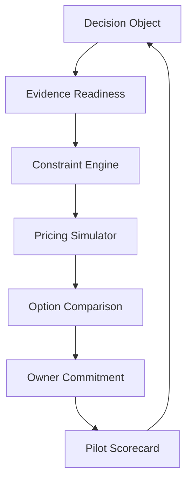

# Pricing Decision System — MVP Architecture

## 当前形态

首版是无后端的交互式 Web MVP，使用模拟数据验证决策流程。数据和数值逻辑在浏览器内运行，不调用外部模型或公司系统。


## 组件职责

| 模块 | 当前实现 | 后续演进 |
|---|---|---|
| Decision State | React 页面内共享状态 | 持久化 Decision Object |
| Pricing Model | `lib/pricing-model.ts` 确定性函数 | SKU 替代网络、价格区间与概率模拟 |
| Evidence | 固定模拟证据包 | SQL/文件/调研数据 Workflow |
| Constraints | 显式规则与护栏 | 企业 Decision Constitution 规则库 |
| Agent Notes | 规则驱动的解释文案 | 带引用的 LLM 推理和冲突识别 |
| Commitment | Owner 确认弹窗 | 身份、版本、审计与审批链 |
| Learn | 试点计分卡 | 实验数据回流与 Decision Memory |

## 关键设计原则

1. 数值计算与自然语言解释分离；
2. 事实、推断、建议和不确定性分层；
3. 不满足硬约束的方案不能被推荐；
4. 决策提交后冻结证据和假设版本；
5. 复盘评估判断质量，不只评估结果好坏。

## 目录

```text
pricing-agent/
├── PRD.md
├── ARCHITECTURE.md
├── README.md
└── demo/
    ├── app/                 # 决策工作台界面
    ├── lib/pricing-model.ts # 确定性模拟
    └── tests/               # 模型与构建验证
```
