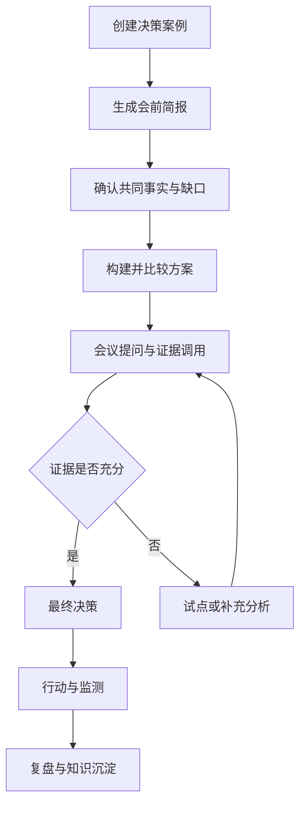
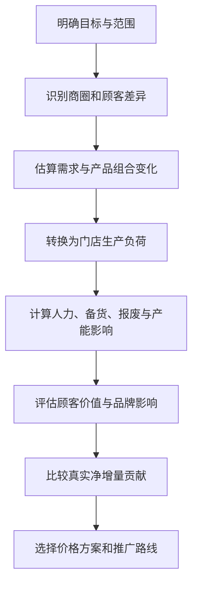

# 菜单定价决策会议工作台 MVP PRD

> 产品英文名：Menu Pricing Decision Room  
> 版本：V1.0  
> 日期：2026-07-22  
> 文档状态：原型开发基线  
> 适用场景：连锁餐饮品牌针对单个套餐、单品或小范围产品组合进行价格调整决策

---

## 1. 产品摘要

### 1.1 产品定义

菜单定价决策会议工作台，是一个围绕“一项具体套餐价格调整决策”运行的会议沟通与决策支持平台。

系统把经营目标、市场范围、商圈与顾客差异、产品及门店运营约束、竞品信息、财务情景、管理层意见、备选方案、最终决定、执行计划和复盘安排，整合为一条可追溯的决策链。

系统不替代CEO、COO或经营委员会作出决定，也不把管理层经验排除在外。它负责：

- 建立与会者共享的事实基础；
- 将管理观点转化为事实、假设、约束、偏好、问题或方案；
- 用统一口径比较不同方案的收益、代价与风险；
- 在会议中调用已定义的分析能力回答关键问题；
- 记录最终选择、理由、反对意见和仍然存在的不确定性；
- 生成执行、监测、回滚和复盘计划。

### 1.2 核心产品命题

> 在什么市场、什么商圈、面向什么顾客、对哪些产品、以什么价格和推广节奏进行调整，才能在不破坏顾客价值感、品牌价格形象和门店运营稳定性的前提下，提升门店真实盈利能力？

### 1.3 产品设计单位

MVP不建设通用决策平台，而只处理：

> **一场会议、一个套餐调价决策、一个执行与复盘闭环。**

每个决策案例具有唯一决策编号，并保存从发起、分析、会议、决定、执行到复盘的完整版本记录。

---

## 2. 背景与问题

### 2.1 当前典型问题

现有菜单定价会议通常存在以下问题：

1. 会议议题只写“讨论某套餐调价”，没有明确目标、范围、时限和决策人。
2. 财务、市场、运营和门店分别提供不同材料，信息口径不一致。
3. 讨论集中于售价、销量和产品毛利，忽略增量人工、备货、报废、门店产能、出餐时长及其他商品被挤占的机会成本。
4. 使用全国或全部门店平均值，掩盖不同商圈、顾客群、渠道和门店产能的差异。
5. 竞品价格被简单理解为“跟进或不跟进”，缺少竞品可比性和竞争策略判断。
6. 管理层意见停留在口头表达，不能区分事实、假设、风险偏好和硬性约束。
7. 方案之间使用不同假设，无法形成公平的Trade-off比较。
8. 会中出现的新问题无法快速转化为分析任务并更新会议材料。
9. 最终结论只有“涨价或不涨价”，缺少市场范围、推广路线、成功标准和回滚条件。
10. 会后执行责任、监测指标和复盘时间不明确，无法验证原始假设。

### 2.2 产品需要解决的核心问题

MVP需要帮助决策会议连续回答五个问题：

1. **为什么调整？**——要解决的首要经营问题是什么？
2. **在哪里调整？**——全市场、特定商圈、门店群、渠道还是时段？
3. **对谁和哪些产品调整？**——目标顾客、产品和套餐范围是什么？
4. **如何调整？**——统一价格、价格区域、套餐重构、渠道差异还是维持现状？
5. **按什么路线实施？**——直接推广、小范围试点还是分阶段扩大？

---

## 3. 产品目标与非目标

### 3.1 MVP业务目标

- 提高套餐价格调整会议的决策效率和信息一致性；
- 把价格、需求、顾客价值、商圈差异、门店运营和真实利润放在同一决策模型中；
- 支持管理层在明确Trade-off和不确定性的基础上作出最终决定；
- 把会议结论转化为可执行、可监测、可回滚、可复盘的计划；
- 沉淀可重复使用的菜单定价决策证据和经验。

### 3.2 MVP产品目标

- 让与会者在3分钟内理解本次会议究竟要决定什么；
- 所有关键数值均显示口径、时间、来源及“事实/估算/假设”状态；
- 所有方案使用同一基线和一致假设进行比较；
- 会中管理观点能够被结构化记录并进入证据队列；
- 会中关键问题能够调用预设分析并更新共同事实或方案；
- 决策完成后自动生成决策记录、行动计划和复盘安排。

### 3.3 MVP非目标

第一阶段明确不做：

- 通用决策宪法或覆盖所有经营问题的决策平台；
- AI自动替代CEO、COO或经营委员会作出决定；
- 任意自然语言问题自动生成并执行生产SQL；
- 基于单一综合评分自动推荐“最佳方案”；
- 一店一价的实时动态定价；
- 完整的价格优化算法、需求预测平台或门店数字孪生；
- 一次性连接POS、KDS、排班、库存、CRM等全部生产系统；
- 直接执行改价、菜单发布或门店排班变更。

---

## 4. 典型决策场景

### 4.1 标准决策命题模板

> 是否从【开始时间】起，将【产品/套餐】从【当前价格】调整为【候选价格或产品结构】，面向【市场/商圈/门店群/渠道/顾客群】以【试点/分阶段/全面推广】方式实施，从而改善【首要经营目标】，同时确保【顾客价值、品牌、门店运营和财务Guardrails】不被突破？

### 4.2 原型演示案例

MVP使用一个虚拟案例贯穿所有页面：

> 是否从2026年9月起，将A套餐从28元调整至30元，首先在商务办公和交通枢纽商圈的30家门店试点，以提升门店净增量贡献，同时确保核心顾客复购、P90出餐时长、报废率、投诉率和品牌价格感知不突破预设阈值；试点通过后，再决定是否扩大到社区及其他商圈？

### 4.3 创建决策时必须填写的六类范围

| 范围 | 必填内容 | 示例 |
|---|---|---|
| 决策目标 | 一个首要目标，其他为约束 | 恢复成本上涨造成的利润损失 |
| 市场范围 | 全国、城市、商圈、门店群、渠道、时段 | 上海商务办公与交通枢纽商圈 |
| 产品范围 | 单品、套餐、产品系列、价格带 | A套餐及其相关加购产品 |
| 顾客范围 | 会员、非会员、新客、高频客、场景客群 | 午餐刚需与高频会员 |
| 时间范围 | 永久、阶段、季节、促销或测试 | 6周试点 |
| 推广路线 | 全面、分阶段、试点或维持现状 | 30家门店试点后分批扩大 |

竞争策略作为必填补充项：跟随、保持接近、维持溢价、仅监测或不作为直接约束。

---

## 5. 用户与角色

| 角色 | 核心职责 | 系统权限 |
|---|---|---|
| 决策发起人 | 提出问题，明确目标、范围和时限 | 创建案例、提交会前材料 |
| 会议主持人 | 控制会议主线，确认问题和结论 | 切换会议阶段、管理问题队列、发起表决或确认 |
| 最终决策者 | 选择方案并确定风险偏好 | 批准、条件批准、试点、延期或否决 |
| 财务/数据分析人员 | 维护数据口径，运行分析，解释结果 | 更新证据、情景计算和数据状态 |
| 品牌/产品负责人 | 判断顾客价值、价格形象和产品结构 | 提交约束、方案和风险判断 |
| 运营/门店负责人 | 判断门店产能、SOP、人力、备货和报废影响 | 更新产品与门店运营参数、提出执行约束 |
| 执行Owner | 将决定转化为实施计划并汇报进展 | 接收任务、更新状态、提交异常 |
| 会议参与者 | 提问、挑战假设、表达偏好或异议 | 提交问题、观点和评论 |

### 5.1 决策权限原则

- 常规、小范围、容易回滚的调整，可由品类或运营负责人决定；
- 涉及核心价格形象商品、跨区域或较大经营影响的调整，由COO决定；
- 涉及全国价格体系、品牌定位或重大财务影响的调整，由CEO或经营委员会决定；
- 系统根据事先配置的金额、门店数量、市场范围和品牌风险阈值提示决策层级，但不自动任命决策者。

---

## 6. 会议生命周期

### 6.1 总体流程



### 6.2 会前阶段

系统支持：

1. 创建决策命题并校验六类范围是否完整；
2. 选择决策者、主持人、分析Owner和执行Owner；
3. 导入或选择相关数据；
4. 自动生成5—8条关键共同事实；
5. 标记缺失数据、低质量数据和未经验证的假设；
6. 自动生成“不行动”基准方案及2—4个候选方案；
7. 生成初始问题清单和预设分析；
8. 生成会议议程和会前简报；
9. 将需提前准备的问题分派给具体Owner。

### 6.3 会中阶段

建议会议时长45—60分钟，会议主持人可根据实际情况调整。

| 阶段 | 建议时间 | 会议输出 |
|---|---:|---|
| 决策框定 | 5分钟 | 确认问题、目标、范围、决策者和截止时间 |
| 共同事实 | 10分钟 | 确认事实、争议口径和证据缺口 |
| 方案与Trade-off | 15分钟 | 确认方案差异、收益、代价和风险 |
| 关键问题与证据调用 | 10—20分钟 | 回答可能改变选择的问题 |
| 决策与承诺 | 10分钟 | 选择方案、确定条件、Owner及复盘时间 |

系统在会中支持：

- 全屏会议模式；
- 固定显示当前决策命题、阶段和剩余时间；
- 记录参与者观点；
- 将观点分类为事实、假设、约束、偏好、问题、风险或新方案；
- 将关键问题加入证据队列；
- 调用预设分析并返回结果；
- 经人工确认后更新共同事实与方案；
- 高亮显示会议过程中发生变化的字段；
- 记录少数意见和反对理由；
- 支持批准、条件批准、试点、延期或否决五类决定。

### 6.4 会后执行阶段

- 冻结决策会议版本；
- 自动生成决策纪要；
- 自动生成行动项、Owner、截止日期和依赖项；
- 创建监测指标及预警阈值；
- 设置扩大、暂停和回滚条件；
- 设置下一次检查点和正式复盘日期；
- 记录执行偏差、环境变化和新增风险。

### 6.5 复盘阶段

复盘不只判断结果好坏，还要区分：

- 原始问题是否定义正确；
- 关键假设是否成立；
- 数据和模型是否存在偏差；
- 方案是否按计划执行；
- 门店执行是否发生偏差；
- 竞品、成本或市场环境是否发生变化；
- 结果偏差来自决策、执行还是外部环境；
- 哪些经验应进入下一次套餐定价决策。

---

## 7. 核心决策逻辑

### 7.1 决策主线



### 7.2 真实经营贡献模型

系统不以产品表面毛利作为最终判别依据，而以门店净增量贡献为核心经济指标：

```text
门店净增量贡献
= 增量销售收入
- 增量食材成本
- 增量人工成本
- 增量备货与报废成本
- 增量包装及渠道成本
- 返工、错单、退款损失
- 被挤占商品的贡献损失
- 其他新增运营成本
```

同时监测顾客价值、品牌和运营Guardrails。即使总利润为正，只要突破硬性约束，也不能直接进入全面推广。

### 7.3 三类判别依据

每个指标必须被标记为以下类型之一：

| 类型 | 定义 | 处理方式 |
|---|---|---|
| 硬性约束 | 不允许被突破的底线 | 方案突破后淘汰、修改或转入小范围试点 |
| 优化目标 | 希望最大化或最小化的核心结果 | 用于方案排序与Trade-off讨论 |
| 信息信号 | 有助判断但不能单独决定方案 | 展示趋势、风险和不确定性 |

系统不将三类指标机械加权成一个总分。

---

## 8. 信息架构与五个核心页面

### 8.1 全局布局

- **顶部固定栏**：决策命题、状态、决策者、会议阶段、截止日期；
- **左侧流程栏**：当前决策、共同事实、方案比较、问题与证据、决策与执行；
- **中央主工作区**：当前阶段的主要内容；
- **右侧协作栏**：会议发言、问题队列、待确认更新和参与者；
- **底部决策栏**：批准、条件批准、试点、延期、否决。

设计原则：一屏只回答一个主要问题；默认只显示影响决策的内容，详细数据通过展开查看。

### 8.2 页面一：当前决策

#### 目标

确保所有与会者对“今天要决定什么”形成一致理解。

#### 核心功能

- 决策命题编辑器；
- 首要经营目标选择；
- 市场、商圈、门店、渠道、顾客、产品和时间范围选择；
- 竞争策略选择；
- 推广路线初始选择；
- 决策层级和最终决策者确认；
- 决策截止日期；
- 顾客、品牌、运营和经济Guardrails设置；
- 范围完整性检查；
- 决策命题版本记录。

#### 页面必须回答

- 为什么现在需要决定？
- 决定的对象和范围是什么？
- 什么不在本次决策范围内？
- 谁作最终决定？
- 什么结果算成功？

### 8.3 页面二：共同事实

#### 目标

建立可被所有与会者验证和共享的事实基础。

#### 核心功能

- 5—8条关键事实摘要；
- 商圈—顾客—门店三层信息切换；
- 数据来源、口径、时间范围和刷新时间；
- 事实、估算、假设、管理判断四种状态标签；
- 数据质量和样本量提示；
- 事实支持或挑战哪个方案的关联；
- 争议事实标记；
- 原始数据和计算逻辑展开；
- 缺失证据提示。

#### 重点事实类别

- 当前价格、销量、折扣、客单和贡献；
- 商圈及顾客结构；
- 历史价格或促销反应；
- 产品组合与替代关系；
- 产品运营复杂度；
- 门店人力、产能、备货和报废；
- 顾客反馈与价格价值感；
- 可比竞品价格及竞争位置。

### 8.4 页面三：方案与Trade-off

#### 目标

在统一基线和相同假设下比较真正不同的方案。

#### 必须包含的基准方案

- 方案0：维持现状，不调整价格。

#### 典型候选方案

- 全市场统一调整；
- 特定商圈或价格区域调整；
- 特定渠道或时段调整；
- 调价并简化产品制作；
- 调整套餐结构而不直接调价；
- 先试点再扩大；
- 保持价格，通过会员权益或本地促销提升价值感。

#### 方案比较维度

| 维度 | 核心内容 |
|---|---|
| 方案动作 | 调什么、在哪里调、对谁调、何时调 |
| 顾客需求 | 销量、频次、复购、产品迁移及不确定区间 |
| 顾客价值 | 价格感知、套餐价值、核心顾客影响 |
| 品牌影响 | 价格形象、价格区域一致性、溢价合理性 |
| 门店运营 | 工时、工位、产能、出餐、备货、报废、错单 |
| 经济结果 | 门店净增量贡献、客单、整体订单贡献 |
| 竞争位置 | 与真正替代选择的价格及价值关系 |
| 可逆性 | 修改、暂停和回滚成本 |
| 关键假设 | 方案成立必须满足的条件 |
| 推广路线 | 直接、试点、分阶段或暂缓 |

#### 核心可视化：商圈价格决策矩阵

| 商圈/门店群 | 核心顾客 | 价格敏感度区间 | 顾客价值风险 | 竞品位置 | 门店产能 | 预期净贡献 | 建议动作 | 推广路线 |
|---|---|---:|---|---|---|---:|---|---|
| 商务办公区 | 午餐刚需、白领 | 中低 | 中 | 略低于竞品 | 高峰接近瓶颈 | 正向 | 试点调价 | 代表门店试点 |
| 成熟社区 | 家庭、高频会员 | 较高 | 高 | 与竞品相当 | 有剩余产能 | 不确定 | 暂不调价 | 作为对照 |
| 交通枢纽 | 临时、低复购 | 较低 | 中 | 低于竞品 | 高负荷 | 明显正向 | 调整价格 | 分批推广 |
| 大学周边 | 学生、价格敏感 | 高 | 很高 | 已高于竞品 | 有剩余产能 | 负向风险 | 调整套餐 | 暂不涨价 |

原型中的数据仅用于演示，正式使用时所有判断必须能够追溯到证据。

### 8.5 页面四：问题与证据队列

#### 目标

把会议发言转化为能够改变方案选择的结构化问题和证据任务。

#### 管理观点分类

| 类型 | 示例 | 系统处理 |
|---|---|---|
| 事实陈述 | A套餐过去半年毛利下降 | 检查数据来源和口径后加入共同事实 |
| 待验证假设 | 涨2元顾客不会在意 | 关联价格敏感度分析或试点验证 |
| 硬性约束 | 核心套餐不能超过30元 | 加入方案准入条件 |
| 风险偏好 | 宁可少赚也不能影响高频客 | 记录为决策者偏好，不包装为事实 |
| 新方案 | 外卖调价、堂食不调 | 自动创建候选方案草稿 |
| 关键问题 | 销量最多下降多少仍然保本 | 调用盈亏平衡分析 |
| 反对意见 | 社区门店会出现价值感问题 | 关联受影响方案并保留在决策记录中 |

#### 问题状态

- 待确认；
- 已进入分析；
- 已有结果待审核；
- 已更新共同事实；
- 需要试点；
- 当前无法回答；
- 已关闭。

#### MVP预设分析工具

1. 单品及套餐当前经营表现；
2. 菜单价格梯度与产品角色；
3. 历史调价或促销前后变化；
4. 商圈与顾客群价格敏感度区间；
5. 产品组合、替代和连带购买变化；
6. 盈亏平衡销量变化；
7. 产品主动操作工时与门店产能影响；
8. 备货批次、保质期与报废情景；
9. 门店净增量贡献情景；
10. 标准化竞品价格与价值对比；
11. 试点门店与对照门店建议；
12. 试点成功、扩大和回滚条件检查。

系统只能调用已定义、已验证口径的分析工具。无法回答的问题必须明确标记，不能生成虚构数据。

### 8.6 页面五：决策、执行与复盘

#### 目标

把会议结论转化为可执行、可监测和可复盘的正式承诺。

#### 五类决策结果

- 批准；
- 有条件批准；
- 小范围试点；
- 延期并补充证据；
- 否决。

#### 决策记录必须包含

- 最终选择；
- 适用市场、商圈、门店、渠道、顾客、产品和时间；
- 选择理由；
- 未选择方案及原因；
- 关键假设；
- 仍然存在的不确定性；
- 决策者的风险偏好；
- 少数意见和反对理由；
- 可能使决策失效的变化；
- 决策者电子确认；
- 决策版本及时间戳。

#### 执行计划必须包含

- 任务；
- 执行Owner；
- 截止日期；
- 前置依赖；
- 试点门店和对照门店；
- 监测指标；
- 扩大条件；
- 暂停和回滚条件；
- 检查点和正式复盘日期。

---

## 9. 商圈、顾客与价格区域设计

### 9.1 商圈分类

MVP支持以下商圈标签：

- 商务办公区；
- 成熟社区；
- 新兴住宅区；
- 商场购物中心；
- 交通枢纽；
- 学校及大学周边；
- 旅游景区；
- 工业园区；
- 混合型商圈。

商圈标签只用于分层，不直接等同于价格敏感度。

### 9.2 顾客分层

MVP支持：

- 新顾客与复购顾客；
- 会员与非会员；
- 高频、中频与低频顾客；
- 堂食与外卖顾客；
- 午餐刚需、家庭多人和单人快捷消费；
- 促销高敏感与低敏感顾客；
- 套餐高偏好顾客。

所有顾客分层必须有数据规则，不能仅凭商圈名称推断。

### 9.3 价格区域原则

- MVP最多支持3—5个可解释的价格区域；
- 不建议直接实施一店一价；
- 附近门店价格差异必须可解释；
- 核心价格形象商品优先保持相对一致；
- 差异化优先考虑套餐、会员权益、时段和渠道，而非无限拆分基础价格；
- 全国平均利润不能掩盖某些核心顾客群或商圈受到明显伤害。

---

## 10. 产品与门店运营模型

### 10.1 产品运营复杂度档案

每个分析产品至少包含：

| 字段 | 定义 |
|---|---|
| 主动操作工时 | 员工实际操作分钟数 |
| 总制作周期 | 开始制作到可交付的时间 |
| 涉及工位 | 前台、后厨、炸炉、烤炉、饮料、打包等 |
| 瓶颈工位 | 可能限制门店产能的关键工位 |
| 最小备货批次 | 每次最低生产、解冻或准备数量 |
| 保质期 | 备货完成后的有效时间 |
| 技能要求 | 是否需要熟练员工或专岗 |
| 返工与差错率 | 重做、错单和失败概率 |
| 当前报废率 | 当前销量条件下的报废水平 |
| 最大稳定产能 | 不明显伤害其他订单时的产量 |
| 高峰敏感度 | 是否集中占用高峰期资源 |

### 10.2 门店运营能力档案

| 字段 | 定义 |
|---|---|
| 分时段订单量 | 每15或30分钟订单及产品数量 |
| 人力配置 | 时段、岗位和可用工时 |
| 关键工位产能 | 炸炉、烤炉、制作台等实际能力 |
| 当前负荷率 | 现有订单对工位和人员的占用程度 |
| 出餐时长 | 平均及P90出餐时长 |
| 备货与报废 | 按产品和时段记录 |
| 加班触发点 | 增量销量达到多少需要额外人力 |
| 门店动线约束 | 空间、设备和操作冲突 |
| 员工熟练度 | 新店、成熟店和高流失店差异 |

### 10.3 运营情景计算原则

- 不把UPH作为所有门店和产品通用的固定常数；
- 先把销量变化转换为主动操作工时、备货批次和瓶颈工位负荷；
- 人力成本允许使用阶梯函数：低于阈值不增加排班，超过阈值触发加班或新增班次；
- 报废根据批次、保质期、时段销量和需求波动计算；
- 识别复杂产品挤占其他高贡献商品的机会成本；
- 输出区间和阈值，不制造虚假精度；
- 数据不足时转为试点测量任务。

---

## 11. 竞品策略模块

### 11.1 竞品识别

系统要求业务人员先确认顾客在该消费场景中的真实替代选择，包括：

- 相同品类品牌；
- 相同价格带品牌；
- 满足相同用餐需求的其他品类；
- 便利店、食堂、外卖或自行带饭；
- 不消费或延迟消费。

### 11.2 标准化比较

竞品比较需要尽量统一：

- 产品份量；
- 原材料和质量；
- 套餐组成；
- 堂食与外卖渠道；
- 标价、促销和会员价；
- 配送费及顾客实际支付价格；
- 服务、便利性和门店体验。

### 11.3 可选竞争立场

- 保持价格相当；
- 保持低于竞品；
- 允许有限溢价；
- 明确高端定位；
- 不跟随但持续监测；
- 只在核心价格形象商品上跟随。

竞品价格作为外部坐标，不能替代自身顾客价值和经营模型。

---

## 12. 试点与推广路线

### 12.1 推广方式

| 方式 | 适用条件 |
|---|---|
| 直接推广 | 历史证据充分、差异小、风险低、容易回滚、运营变化有限 |
| 小范围试点 | 价格敏感度、门店产能、报废或顾客反应存在明显不确定性 |
| 分阶段推广 | 方向基本成立，但不同商圈、门店或渠道表现存在差异 |
| 暂缓 | 关键数据缺失、方案突破硬性约束或执行能力未准备好 |

### 12.2 试点设计要求

- 试点假设；
- 试点门店和对照门店；
- 商圈及门店代表性；
- 试点价格和产品方案；
- 试点开始及结束日期；
- 主要成功指标；
- 顾客、品牌和运营Guardrails；
- 最低样本或观察周期；
- 扩大条件；
- 暂停及回滚条件；
- 试点复盘责任人。

试点周期由购买频率、销量规模和业务周期决定，不在系统中固定写死。

---

## 13. 会前材料自动生成

### 13.1 输入

- 决策命题和范围；
- 数据集或预设演示数据；
- 产品与门店运营档案；
- 商圈和顾客分层；
- 竞品信息；
- 候选方案；
- 管理层已知意见和约束。

### 13.2 自动生成内容

- 一页决策摘要；
- 会议目标和议程；
- 5—8条关键共同事实；
- 数据和证据缺口；
- 不行动基准方案；
- 候选方案比较；
- 商圈价格决策矩阵；
- 门店运营影响摘要；
- 建议讨论的关键问题；
- 需要提前准备的分析任务。

### 13.3 输出格式

MVP支持：

- 平台内会议模式；
- Markdown决策简报；
- PDF会议材料；
- 决策纪要导出；
- 行动清单导出。

导出内容必须保留数据状态、来源、版本和生成时间。

---

## 14. 数据要求

### 14.1 MVP数据模式

原型阶段采用：

- 内置模拟数据；
- CSV或Excel手工导入；
- 表单方式补充产品工时、备货和报废参数；
- 不直接连接生产系统；
- 不自动执行改价或菜单发布。

### 14.2 最低数据集

#### 交易数据

- 订单编号；
- 门店、商圈和城市；
- 交易日期及时间；
- 产品及套餐；
- 数量、标价、实付价和折扣；
- 订单金额；
- 堂食、外卖等渠道；
- 匿名顾客或会员编号；
- 新客、复购及频次标签。

#### 产品数据

- 产品编号和名称；
- 套餐组成；
- 标准成本和BOM；
- 包装及渠道成本；
- 主动操作工时；
- 工位、批次、保质期和复杂度参数。

#### 门店运营数据

- 分时段订单量；
- 排班和工时；
- KDS或出餐时长；
- 备货、报废和缺货；
- 错单、返工、退款和投诉；
- 工位产能和加班阈值。

#### 市场及顾客数据

- 商圈分类；
- 顾客分层；
- 购买频率和复购；
- 产品迁移和连带购买；
- 价格与价值感反馈。

#### 竞品数据

- 竞品和门店；
- 产品、规格和套餐组成；
- 标价、促销价、会员价和实际到手价；
- 数据采集日期和渠道；
- 可比性说明。

### 14.3 数据展示要求

每个数值必须显示：

- 指标名称；
- 计算口径；
- 数据时间范围；
- 适用市场和样本；
- 数据来源；
- 刷新时间；
- 事实、估算或假设状态；
- 置信度或数据质量提示。

---

## 15. 功能需求清单

| 编号 | 功能 | 优先级 | 验收要点 |
|---|---|---|---|
| FR-01 | 创建决策案例 | Must | 完成六类范围和决策者配置后才能进入会前准备 |
| FR-02 | 决策命题生成与校验 | Must | 自动生成一句话命题并提示缺失范围 |
| FR-03 | 共同事实管理 | Must | 每条事实显示来源、口径、状态并可关联方案 |
| FR-04 | 方案创建与统一比较 | Must | 至少支持现状及三个候选方案，使用一致基线 |
| FR-05 | 商圈价格决策矩阵 | Must | 可按商圈、门店群查看价格敏感度、风险、产能和建议 |
| FR-06 | 顾客分层影响 | Must | 显示不同顾客群的销量、复购和价值风险 |
| FR-07 | 产品运营复杂度档案 | Must | 支持工时、工位、批次、保质期和报废参数 |
| FR-08 | 门店运营能力档案 | Must | 支持分时段负荷、产能、出餐、加班和报废参数 |
| FR-09 | 真实净增量贡献情景 | Must | 包含食材、人工、报废、渠道、返工和机会成本 |
| FR-10 | 管理观点结构化 | Must | 可分类为事实、假设、约束、偏好、问题、风险或方案 |
| FR-11 | 问题与证据队列 | Must | 支持状态、Owner、截止日期和分析结果回写 |
| FR-12 | 预设分析调用 | Must | 能调用至少8项预定义分析，不允许虚构答案 |
| FR-13 | 会议模式 | Must | 固定显示决策命题、会议阶段、问题队列和决策入口 |
| FR-14 | 决策记录 | Must | 支持五类结论并记录理由、假设、异议和失效条件 |
| FR-15 | 行动与复盘计划 | Must | 自动生成Owner、时间、指标、扩大及回滚条件 |
| FR-16 | 决策版本与审计 | Must | 决策后冻结版本，后续修改形成新版本 |
| FR-17 | 会前材料生成 | Should | 自动生成Markdown及PDF会议材料 |
| FR-18 | 竞品标准化比较 | Should | 支持规格、渠道、促销和实际支付价格比较 |
| FR-19 | 评论与@提醒 | Should | 支持参与者评论、分派和状态提醒 |
| FR-20 | 多案例知识复用 | Could | 复用历史假设、分析和复盘结论 |

---

## 16. AI能力边界

### 16.1 AI可以做

- 根据结构化输入生成决策命题；
- 生成会前摘要和会议议程；
- 将管理层发言分类；
- 提取关键问题、假设、约束和异议；
- 建议需要调用的预设分析；
- 解释情景计算及其业务含义；
- 在人工确认后更新共同事实和方案；
- 生成决策纪要、行动计划和复盘提纲。

### 16.2 AI不能做

- 编造缺失数据或证据；
- 把管理判断自动改写成已验证事实；
- 在未经确认的情况下修改正式决策材料；
- 自动覆盖指标定义和数据版本；
- 只凭相关性宣称价格变化造成了业务结果；
- 自动替代最终决策者选择方案；
- 自动发布价格或执行门店变更。

### 16.3 人工确认点

以下操作必须人工确认：

- 共同事实正式入库；
- 指标口径调整；
- 新方案加入正式比较；
- Guardrails修改；
- 分析结果回写决策卡；
- 最终决策；
- 扩大、暂停和回滚。

---

## 17. 状态、版本与追溯

### 17.1 决策状态

```text
草稿 → 会前准备 → 待开会 → 会议中 → 待补证据/试点
→ 已决策 → 执行中 → 待复盘 → 已关闭/重新决策
```

### 17.2 版本规则

- 会前材料每次重大修改形成版本；
- 会议开始时冻结会前版本；
- 会中更新保留修改人、时间、旧值和新值；
- 最终决策确认后生成不可覆盖的正式版本；
- 后续市场变化需要重新决策时，复制为新案例并保留关联；
- 复盘结果附加到原决策，不修改当时事实和判断。

---

## 18. 非功能要求

### 18.1 可用性

- 首页在3分钟内可让首次参与者理解决策命题；
- 核心页面不超过五个；
- 默认每页只展示影响选择的重点信息；
- 详细数据、公式和来源通过展开查看；
- 关键风险、证据缺口和Guardrail突破使用一致视觉语言。

### 18.2 性能

- 页面切换目标响应时间小于2秒；
- 已预计算分析结果应即时展示；
- 长时间分析进入队列，不阻塞会议操作；
- 会议模式下必须清楚显示数据是否仍在计算。

### 18.3 可解释性

- 每项建议必须能回溯到事实、假设和规则；
- 每个情景必须显示输入参数和适用范围；
- 不能只输出“推荐方案C”，必须说明为什么、依赖什么假设、牺牲什么；
- 平均结果必须能够下钻到商圈、顾客群和门店群。

### 18.4 安全与权限

- 按角色控制编辑、确认和最终决策权限；
- 顾客数据使用匿名标识；
- 记录重要修改和决策操作；
- 原型不保存真实敏感顾客信息。

---

## 19. 原型开发范围

### 19.1 MVP Must Have

- 一个完整虚拟套餐调价案例；
- 五个核心页面；
- 三类商圈及三类顾客群；
- 现状方案及至少三个候选方案；
- 产品复杂度和门店能力档案；
- 价格、销量、运营和净增量贡献情景；
- 商圈价格决策矩阵；
- 管理观点分类和问题队列；
- 预设分析结果回写；
- 五类最终决策；
- 行动、扩大、暂停、回滚和复盘计划；
- Markdown会议材料与决策纪要导出。

### 19.2 原型可使用的模拟方案

- 方案0：维持28元；
- 方案A：所有市场统一调整到30元；
- 方案B：办公及交通枢纽商圈调整到30元，其他商圈维持28元；
- 方案C：保持28元，但调整套餐组成或会员权益；
- 方案D：先在30家门店进行6周测试，再决定是否扩大。

所有数值必须明确标记为模拟数据。

### 19.3 原型暂不包含

- 生产系统接口；
- 自动改价；
- 真实门店实时监控；
- 复杂机器学习弹性模型；
- 自动生成任意SQL；
- 多品牌、多国家和多币种；
- 移动端完整适配。

---

## 20. 用户故事

### US-01 决策发起人创建会议

作为决策发起人，我希望填写套餐、目标、市场、商圈、顾客、时间和推广范围，以生成清晰的决策命题，避免会议议题含糊。

### US-02 COO快速掌握问题

作为最终决策者，我希望在进入会议后三分钟内看到关键问题、共同事实、主要方案和重大风险，不需要阅读长篇分析报告。

### US-03 运营负责人挑战销量假设

作为运营负责人，我希望指出销量增长会增加工时、备货和报废，并让系统把这些影响加入方案计算。

### US-04 分析人员回答关键问题

作为分析人员，我希望从问题队列选择预设分析、调整可见参数并回传结果，不需要临时制作新的PPT。

### US-05 品牌负责人设置价值Guardrail

作为品牌负责人，我希望明确核心价格形象、顾客公平感和品牌溢价边界，避免单纯为了短期利润破坏价值感。

### US-06 决策者选择分商圈方案

作为决策者，我希望比较全国统一调价与特定商圈调价的收益和风险，并选择试点、分阶段或全面推广。

### US-07 执行Owner接收计划

作为执行Owner，我希望会后立即获得门店名单、时间、任务、成功指标和回滚条件。

### US-08 复盘人还原原始逻辑

作为复盘负责人，我希望三个月后仍能看到当时的事实、假设、反对意见和选择理由，区分决策问题、执行偏差和外部变化。

---

## 21. MVP验收场景

原型必须完整演示以下流程：

1. 发起人创建“A套餐28元调整到30元”的案例；
2. 系统提示首要目标、市场范围或Guardrail缺失；
3. 发起人完成范围后，系统生成标准决策命题；
4. 系统生成共同事实、数据缺口和四个候选方案；
5. 与会者查看商务办公、社区和交通枢纽商圈差异；
6. 运营负责人提出“销量增长会增加高峰工时和报废”；
7. 系统将发言识别为待验证假设并加入问题队列；
8. 分析人员调用产品工时、瓶颈产能和报废情景；
9. 结果经确认后更新方案B和方案D的门店净增量贡献；
10. 品牌负责人提出社区核心会员价值感风险；
11. 系统更新顾客Guardrail和商圈价格决策矩阵；
12. 决策者选择“办公及交通枢纽商圈30店试点”；
13. 系统生成试点门店、对照门店、行动Owner、成功指标、暂停和回滚条件；
14. 决策者确认并冻结正式版本；
15. 系统导出Markdown/PDF决策纪要和行动清单；
16. 到达检查点后进入复盘页面，对比原始假设和实际结果。

---

## 22. 成功指标

### 22.1 会议效率指标

- 决策命题一次确认率；
- 会前材料准备时间；
- 会议中用于寻找数据的时间；
- 会议结束时形成明确结论的比例；
- 会后行动计划生成时间；
- 因口径争议而重新开会的比例。

### 22.2 决策过程质量指标

- 关键数值具备来源和口径的比例；
- 方案使用一致假设的比例；
- 未验证假设被明确标记的比例；
- 最终决定包含理由、失效条件和异议的比例；
- 决策包含监测、暂停及回滚条件的比例；
- 正式复盘完成率。

### 22.3 业务结果指标

- 门店净增量贡献；
- 顾客复购及购买频率；
- 核心套餐销量和产品迁移；
- P90出餐时长；
- 人工及加班工时；
- 报废、缺货、错单和退款；
- 顾客价格投诉和价值感反馈；
- 试点扩大、维持、调整或回滚结果。

业务结果用于复盘，不直接等同于决策过程质量。外部环境和执行偏差必须单独识别。

---

## 23. 开发路线

### 阶段0：历史案例回放

- 选取一个真实或接近真实的历史套餐调价案例；
- 还原当时可以获得的数据和管理意见；
- 记录会议最关键的10个问题；
- 验证五个页面是否足以支持会议。

### 阶段1：交互原型

- 使用模拟数据实现五个核心页面；
- 实现观点分类、问题队列、情景更新和决策闭环；
- 组织一次模拟决策会议；
- 根据会议过程调整信息密度和主线。

### 阶段2：真实数据试点

- 选择少量历史交易、门店运营和竞品数据；
- 验证数据口径和情景计算；
- 使用一个真实定价议题运行会前及会议流程；
- 暂不自动执行价格变更。

### 阶段3：生产化评估

- 评估POS、KDS、排班、库存、CRM等接口；
- 建立指标语义和数据质量机制；
- 配置权限、审计、提醒和正式发布流程；
- 根据试点结果决定是否扩大到其他产品和经营决策场景。

---

## 24. 原型开始前需要确认的业务输入

原型开发可先使用模拟数据，但进入真实试点前必须确认：

1. 首个真实套餐和当前价格；
2. 主要经营问题和决策层级；
3. 可用商圈分类及门店数量；
4. 可识别的顾客分层；
5. 可获得的交易、成本、工时、KDS、备货和报废数据；
6. 当前门店是否已有历史价格差异或促销实验；
7. 主要竞品和真实替代选择；
8. 组织中谁负责数据、品牌、产品、运营、最终决定和执行；
9. 试点可接受的时间、门店范围和回滚机制；
10. 哪些指标属于不可突破的硬性Guardrails。

---

## 25. 最终产品原则

1. 系统服务于一项具体决定，而不是展示更多数据。
2. 先明确目标和范围，再进入分析。
3. 维持现状必须作为正式基准方案。
4. 全国平均结果不能掩盖商圈、客群和门店差异。
5. 产品表面毛利不能替代门店真实净增量贡献。
6. 门店操作、工时、备货、报废和产能是方案成立的前置条件。
7. 竞品价格是外部参考，不是自动跟随指令。
8. 管理经验必须被保留，但要区分事实、假设、约束和偏好。
9. 不确定问题要通过补充证据或试点解决，不能被AI虚构填补。
10. 最终决定由有权限的管理者作出，并明确理由和风险承担。
11. 执行者对实施负责，决策者对目标、选择和风险偏好负责。
12. 每项决策必须进入监测和复盘，才能形成可积累的组织能力。

---

## 26. 一句话产品定位

> **菜单定价决策会议工作台，把经营问题、商圈与顾客差异、门店运营约束、数据证据、管理判断、方案Trade-off和执行承诺，整合到一条可追溯的定价决策链中。**

